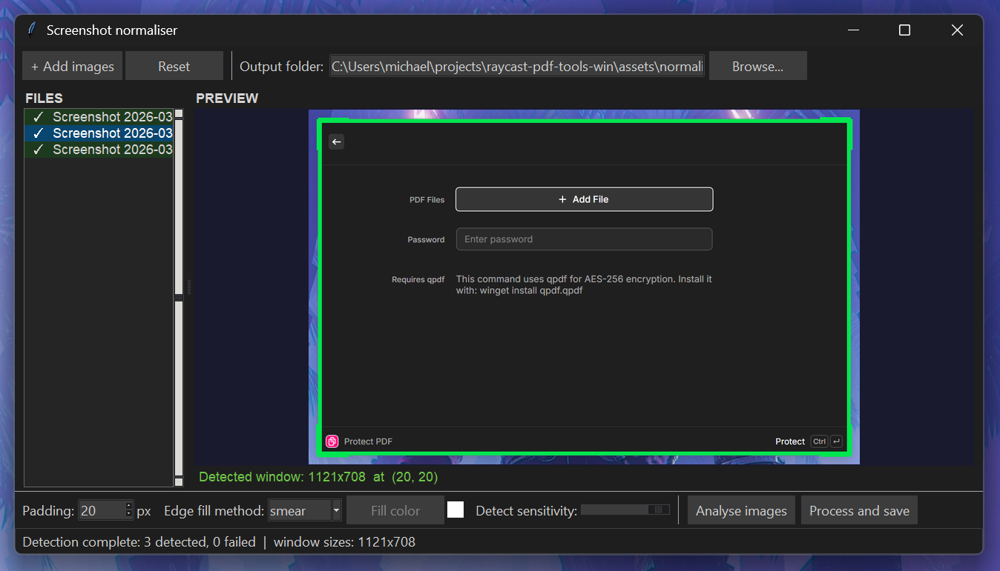

# Screenshot normaliser

Detects the visible app window in related screenshots, and then crops, pads, and outputs all of them at a consistent size with uniform spacing around the window - useful for a set of screenshots taken at slightly different sizes (e.g.: from using a free-hand screenshot tool).



## Features

- Window detection via ML background removal ([rembg + U2-Net](https://github.com/danielgatis/rembg)), luminance projection, background colour distance, edge detection, and contour analysis - results are intersected for best guess
- Consensus sizing: all output images share the same dimensions
- If filling is needed: uniform wallpaper-coloured border sampled from the original background

## Requirements

- Python 3.10+
- [uv](https://github.com/astral-sh/uv)

## Quick start

```sh
uv run normaliser.py
```

`uv run` reads the inline script metadata and installs all dependencies (`opencv-python`, `Pillow`, `numpy`, `rembg`) into a temporary environment.

## Project venv

```sh
uv sync
uv run python normaliser.py
```

## Usage

1. Click **Add images** to load one or more screenshots.
2. Click **Analyse images** - detects the application window in each image. Click through the image list to verify.
3. Adjust **Padding** (pixels added around the detected window) and **Detect sensitivity** if needed.
4. Click **Process and save** - output files are saved as `<name>_normalised<ext>`.

## How it works

All five detection methods run on every image, and their results are **intersected** to produce a conservative, robust bounding box:

1. **ML(rembg/U2-Net)** - removes the wallpaper background and derives the window bounds from the alpha mask.
2. **Luminance projection** - Otsu threshold + row/column fraction arrays; finds the longest contiguous run above a threshold in each axis.
3. **Background colour distance** - compares each pixel to the corner-sampled wallpaper colour.
4. **Edge/Hough-line detection** - looks for long horizontal and vertical lines bounding the window.
5. **Contour analysis** - finds the largest external contour after edge dilation.

Each method's bounding box is intersected (maximum of left/top edges, minimum of right/bottom edges), so that methods which expand too far toward the image boundary are clipped by the more conservative ones.

Run endpoints are also trimmed using a relative threshold: trailing rows/columns whose foreground density falls below 50% of the peak density inside the detected region are removed. This handles wallpaper figures or gradients that cross the absolute threshold but are clearly outside the window.

## Dependencies

| Package | Purpose |
|---|---|
| `opencv-python` | Thresholding, edge detection |
| `Pillow` | Image I/O, resize, compositing |
| `numpy` | Array operations |
| `rembg` | ML background removal (U2-Net) |

## License

[MIT](LICENSE) © 2026 Michael Champanis
